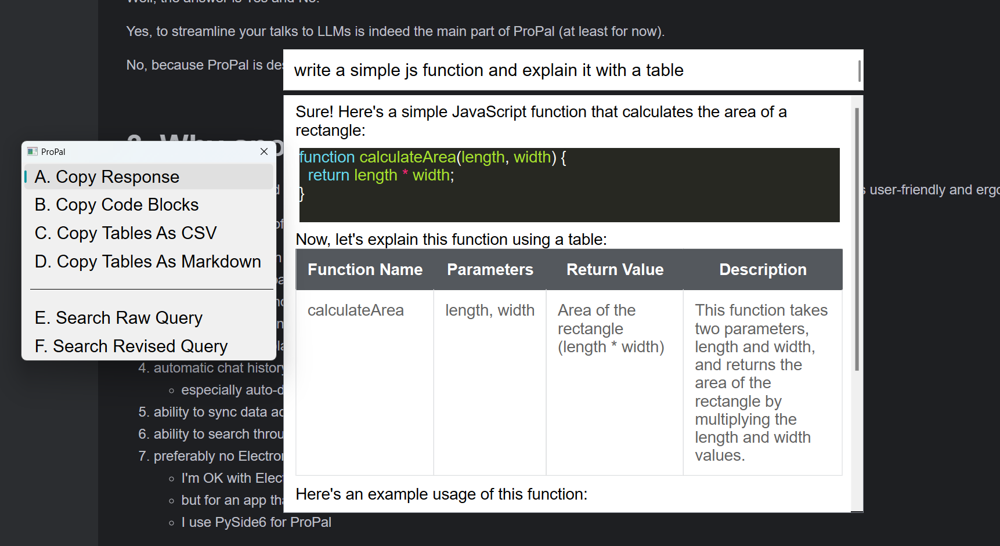
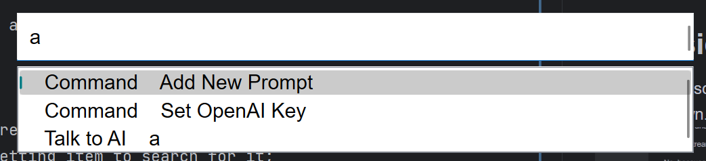
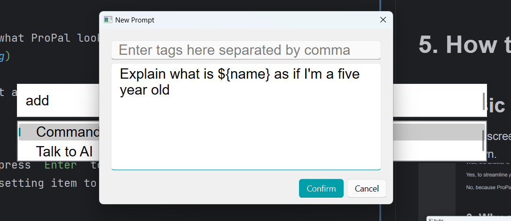
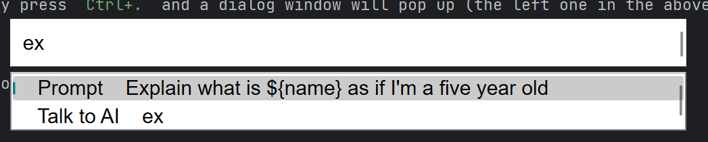
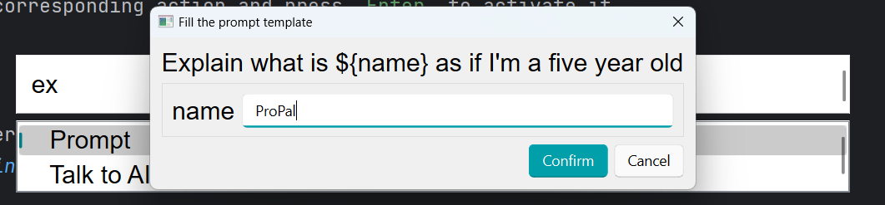

<!-- TOC start (generated with https://github.com/derlin/bitdowntoc) -->

- [1. What is ProPal?](#1-what-is-propal)
- [2. Is it just another interface for ChatGPT?](#2-is-it-just-another-interface-for-chatgpt)
- [3. Why another interface for ChatGPT?](#3-why-another-interface-for-chatgpt)
- [4. What will ProPal become?](#4-what-will-propal-become)
- [5. How to use ProPal?](#5-how-to-use-propal)
    * [5.1 Basic Usage](#51-basic-usage)
    * [5.2 Context Actions](#52-context-actions)
    * [5.3 Add New Prompts](#53-add-new-prompts)
    * [5.4 Use Prompt](#54-use-prompt)
    * [5.5 Transfer Data To Another Computer](#55-transfer-data-to-another-computer)
- [6. How to convert the source code into an executable by yourself?](#6-how-to-convert-the-source-code-into-an-executable-by-yourself)

<!-- TOC end -->

<!-- TOC -->

# 1. What is ProPal?

ProPal is an **ergo-centric** and **keyboard-first** productivity booster that utilizes LLM.

<!-- TOC -->

# 2. Is it just another interface for ChatGPT?

Well, the answer is both Yes and No.

Yes, streamlining your interactions with LLMs is indeed the most significant aspect of ProPal (at least for now).

No, because ProPal is designed to be a productivity booster and LLMs are just one of the tools used to achieve that.

<!-- TOC -->

# 3. Why another interface for ChatGPT?

After using ChatGPT and some software that offer an interface to help interact with it for a while, I find them to be
less user-friendly than they could have been.

Here are some features that I would like to see in a better interface:

* ability to use my own API key
* full of intuitive keyboard shortcuts
  * I like VIM, and moving my hand from the keyboard to the mouse is annoying
* easy prompt injection and management
  * preferably templates with variables to be filled in at the time of use
* automatic chat history management
  * especially auto-deletion of old chats
* ability to sync data across devices
* ability to search through chat history and prompts
* preferably no Electron
  * I'm OK with Electron in general
  * but for an app that will likely to be constantly running in the background, I do want it to be memory efficient
  * I use PySide6 for ProPal
* preferably portable
  * I particully hate those that can only be installed in your`C:` drive

It would be a great chat interface for LLMs if it can meet all the above requirements. But, it is still not enough for a
productivity booster.

<!-- TOC -->

# 4. What will ProPal become?

Currently, ProPal is still in its infancy and lacking many features (to see what it can do now, go to Section 5. How To
Use ProPal)

In the future when it becomes more mature, it should be a great interface to interact with LLMs. So all the features
above will be implemented (some are already done).

After implementing all of the above features, I will work on a plugin system for it to extend its capabilities.

This plugin system will:

1. support Python and hopefully JavaScript;
2. allow ProPal to perform tasks that are not directly related to LLMs:

- launching apps
- math calculations
- note taking
- clipboard management
- etc.

3. allow users to interact with LLMs in more ways:

- talking with documents
- asking multiple questions at once
- directly running Python/JavaScript codes they write
- checking validity of their responses automatically
- and many more that are in my mind and this list will be excruciatingly long if I put them all here

4. support task automation

<!-- TOC -->

# 5. How to use ProPal?

<!-- TOC -->

## 5.1 Basic Usage

The following screen-grabbed picture shows what ProPal looks like with its main features.

ProPal has a global hotkey `Alt+X` to show/hide it.

When you open ProPal, all you see is just a simple input box and everything happens.

You can directly type inside it:

1. whatever you want to say to LLMs and press `Enter` to send it to LLMs;
2. initials or consecutive letters of a setting item to search for it;
3. words of a prompt to search for it;

<!-- TOC -->

## 5.2 Context Actions

After getting a response from LLMs, simply press `Ctrl+.` (the context action shortcut in VS Code) and a dialog window
will pop up (the left one in the above picture) with all available actions.

Press the starting letter to select the corresponding action and press `Enter` to activate it.

<!-- TOC -->

## 5.3 Add New Prompts

Type in initials or any consecutive letters of `add new prompt` and press `Enter` to add a new prompt.

You can add tags and variables to your prompt. Variables must be surrounded by `${` and `}`.

Press `Ctrl+Enter` to save your prompt.

<!-- TOC -->

## 5.4 Use Prompt

Type in words of a prompt to search for it.

Press `Enter` and the prompt, if containing no variables, will be injected into the input box. If it contains variables,
a dialog window will pop up for you to fill in the variables first.

<!-- TOC -->

## 5.5 Transfer Data To Another Computer

All your data and custom settings are stored in the `user_data` directory. Just copy it to the new computer.

<!-- TOC -->

# 6. How to compile the source code into an executable on your own?

While PySide6 and Python are both cross-platform but I only have a Windows laptop, so only Windows executables are
provided and the source code is not tested on Mac OS and Linux. I may one day buy a Macbook or use VM to test my code
and provide releases. But before then, users of these OS must build an executable by yourself and hope everything just
works...

To build an executable:

1. download the source code;

2. install the dependencies (I use `Poetry` during development to manage the virtual environment and add dependencies);

3. run `pyinstaller main.spec` and you will find the executable in the `dist/main` directory

4. Note: every time you run `pyinstaller main.spec`, the entire `dist/main` will be overwritten and all yours custom
   settings and data will be lost. Therefore, copy the directory to somewhere else before start using it.
